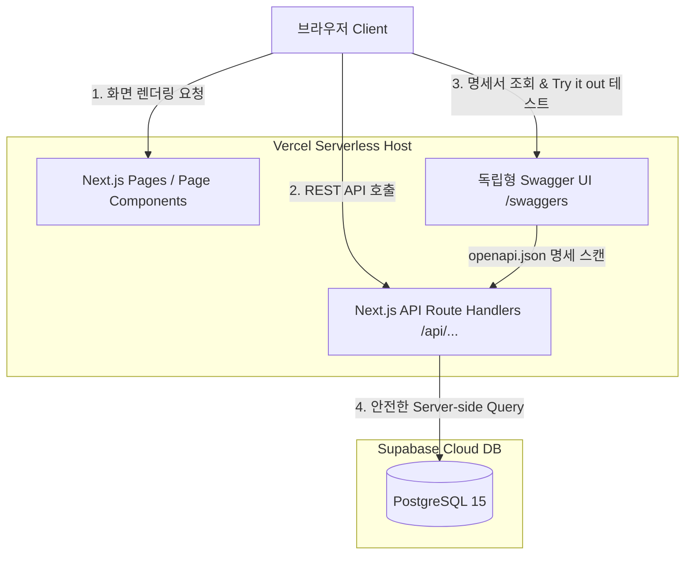

# 📝 MyDevVlog: 최종 고도화된 서버리스 API + Swagger 풀스택 명세서

본 문서는 개발자 전혜원의 미니멀 기술 블로그 **MyDevVlog**의 최종 진화된 **Vercel Serverless API + Supabase PostgreSQL + Swagger UI** 풀스택 아키텍처 사양서입니다.

---

## 🏗️ 1. 최종 시스템 아키텍처 (System Architecture)

기존의 파이썬 백엔드(FastAPI) 서버와 데이터베이스를 클라우드에 따로 올리는 복잡함 대신, **Next.js 내부의 서버리스 함수(API Routes)가 백엔드 REST API 역할을 전담**하고, 데이터 저장소로 **Supabase (PostgreSQL)**를 바인딩하는 최첨단 풀스택 환경을 구현했습니다.



### 🔒 이 구조의 결정적 이점 (보안 및 편의성)
* **보안 극대화**: Supabase의 접속 URL과 Secret Key가 브라우저(클라이언트) 코드에서 완전히 감춰지고, 오직 안전한 **Vercel 서버 단(Server-side) 내부에서만 보관 및 동작**합니다.
* **배포 단일화**: 프론트엔드와 백엔드가 한 몸(Next.js)으로 합쳐져 있으므로, Vercel 웹 호스팅 하나만 켜면 백엔드 API 서버까지 24시간 실시간 무중단으로 자동 배포 가동됩니다.
* **통합 명세서**: 내장된 공식 Swagger UI를 통해 배포된 API 상태를 실시간으로 모니터링하고 호출해 볼 수 있습니다.

---

## 🛠️ 2. 기술 스택 명세 (Technology Stack)

| 레이어 | 기술 스택 | 세부 스펙 및 역할 |
| :--- | :--- | :--- |
| **Frontend** | `Next.js v16` | App Router 기반 페이지 구성, React 19 비동기 상태 핸들링 |
| | `TypeScript` | 정교한 엔티티 타입 설계 및 REST API JSON 통신 데이터 안정성 확보 |
| | `Tailwind CSS v4` | 클래스 기반 다크/라이트 모드 테마 동적 변환 및 미니멀 UI 디자인 |
| **Backend API** | `Next.js Route Handlers` | `/api/posts`, `/api/posts/[id]/view` 등 서버리스 REST API 엔드포인트 구현 |
| **Database** | `Supabase (PostgreSQL)` | RLS(Row Level Security) 접근 제어가 적용된 영속 데이터 저장소 |
| **API Docs** | `Swagger UI` | `/swaggers` 경로로 서빙되는 100% 독립형 공식 Swagger 대시보드 |

---

## 🔌 3. 고도화된 REST API 엔드포인트 목록

모든 API 호출은 `minimal-blog/app/api` 디렉토리 하위의 Next.js Route Handlers를 통해 안전하게 서버 단에서 수행됩니다.

* **`/api/openapi.json` [GET]**
  - 블로그의 API 규격을 Swagger 뷰어가 해석할 수 있도록 OpenAPI 3.0 사양의 JSON 포맷으로 출력합니다.
* **`/api/posts` [GET / POST]**
  - `GET`: Supabase에서 전체 글 리스트를 조회하여 반환합니다 (발행/임시저장 필터 쿼리 지원).
  - `POST`: 새로운 글을 Supabase 데이터베이스에 삽입합니다 (자동 슬러그 ID 및 읽기 시간 연산 처리).
* **`/api/posts/{id}` [GET / PUT / DELETE]**
  - `GET`: 특정 포스트의 상세 데이터를 반환합니다.
  - `PUT`: 포스트 정보를 수정합니다.
  - `DELETE`: 포스트를 영구 삭제합니다 (이때 댓글 테이블에 묶여 있던 연관 데이터도 CASCADE 규칙에 의해 동반 소멸).
* **`/api/posts/{id}/view` [POST]**
  - 해당 포스트의 조회수(`views`) 컬럼을 1 카운트업합니다. 브라우저 세션 감지 후 최초 1회만 정밀하게 쏘도록 조율되어 있습니다.
* **`/api/posts/{id}/comments` [POST]**
  - 특정 포스트에 실시간 댓글 데이터를 삽입합니다.

---

## 🚀 4. 로컬 실행 방법

1. **의존성 모듈 설치**:
   ```bash
   cd minimal-blog
   npm install
   ```
2. **로컬 환경 변수 기입** (`.env.local`):
   ```text
   NEXT_PUBLIC_SUPABASE_URL=https://lgvpuepytluzzaagzmbw.supabase.co
   NEXT_PUBLIC_SUPABASE_ANON_KEY=sb_publishable_AWifvZXuaTwyEf4BOVP_uw_Sn7UOYIo
   ```
3. **서버 실행**:
   ```bash
   npm run dev
   ```
   * **블로그 홈**: `http://localhost:3000`
   * **어드민 패널**: `http://localhost:3000/admin` (비밀번호: `admin1234`)
   * **독립형 Swagger UI**: `http://localhost:3000/swaggers` (API 명세서 실시간 테스트)
