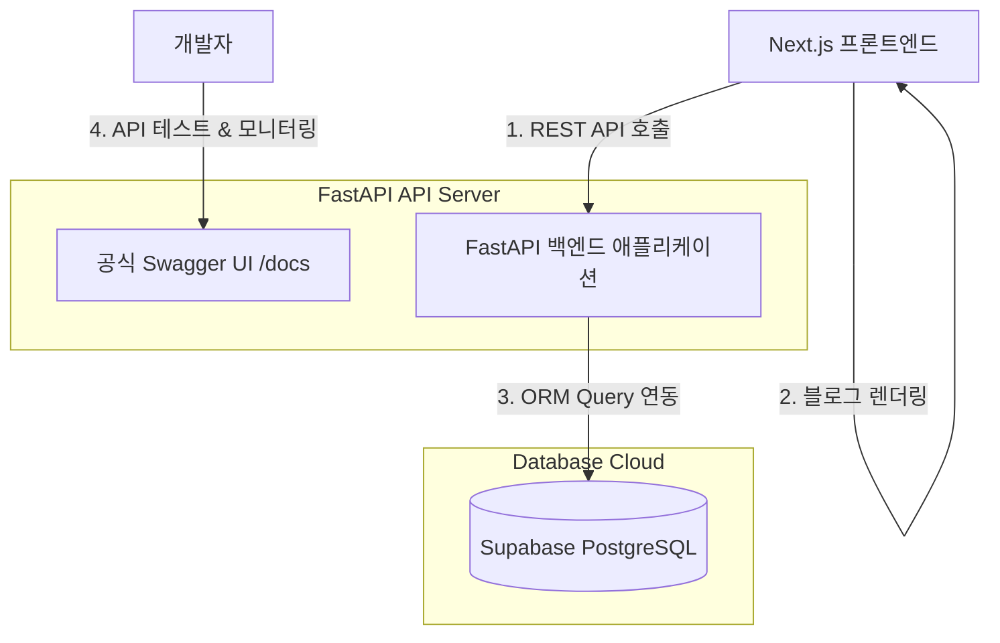

# 📝 MyDevVlog: 최종 고도화된 풀스택 명세서 (FastAPI + Supabase DB)

본 문서는 개발자 전혜원의 미니멀 기술 블로그 **MyDevVlog**의 최종 풀스택 아키텍처 설계 사양서입니다. 

**FastAPI 백엔드 애플리케이션**과 **Supabase 클라우드 PostgreSQL 데이터베이스**를 결합하여 견고하고 확장성 있는 구조를 완성했습니다.

---

## 🏗️ 1. 최종 풀스택 아키텍처 (Architecture Flow)

프론트엔드와 데이터베이스 사이에서 비즈니스 로직(조회수 제어, 데이터 연산, 파싱 등)을 안전하게 처리하기 위해 **파이썬 FastAPI 백엔드 서버**를 가동하고, 데이터 저장소로 글로벌 클라우드 서비스인 **Supabase PostgreSQL**을 결합했습니다.



### 🔒 이 아키텍처의 핵심 이점
* **파이썬 백엔드(FastAPI) 생태계 학습**: 현대 파이썬 웹 개발 표준인 FastAPI의 라우팅 구조, CORS 설정, SQLAlchemy ORM 및 Pydantic 데이터 검증 흐름을 100% 로컬에서 가동 및 제어할 수 있습니다.
* **클라우드 데이터 영속화 (Supabase PostgreSQL)**: 로컬 컴퓨터에 무겁게 PostgreSQL을 설치해 둘 필요 없이, Supabase가 제공하는 실시간 클라우드 PostgreSQL 커넥션을 주입하여 외부 배포 시에도 안정적으로 데이터를 누적합니다.
* **공식 Swagger UI 탑재**: FastAPI 내부 엔진에 탑재된 공식 Swagger UI(`http://localhost:8000/docs`)를 즉시 띄워 API 동작 상태를 테스트할 수 있습니다.

---

## 📊 2. 세부 기술 스택 (Tech Stack Specification)

| 레이어 | 기술 스택 | 세부 스펙 및 역할 |
| :--- | :--- | :--- |
| **Frontend** | `Next.js v16` | App Router 기반의 고성능 SSR/CSR 렌더링 및 페이지 구성 |
| | `TypeScript` | API 통신 DTO 타입 정의 및 정적 타입 에러 컴파일 예방 |
| | `Tailwind CSS v4` | 클래스 기반 다크/라이트 모드 테마 제어 및 미니멀 UI 스타일링 |
| **Backend** | `FastAPI` | 파이썬 비동기 웹 프레임워크를 활용한 REST API 백엔드 서버 구동 |
| | `Uvicorn` | 초경량 ASGI 비동기 웹 서버 엔진 |
| | `SQLAlchemy` | 파이썬 객체와 PostgreSQL 테이블을 유기적으로 이어주는 ORM |
| | `Pydantic v2` | 데이터 입력 및 JSON 응답 형식 스키마 유효성 검증 |
| **Database** | `Supabase (PostgreSQL)` | 클라우드 관계형 데이터베이스. 백엔드의 DB 연결 문자열(Connection String) 주입 |
| **API Docs** | `FastAPI Swagger` | `http://localhost:8000/docs` 주소로 즉각 접속 가능한 백엔드 공식 문서 화면 |

---

## 🔌 3. REST API 엔드포인트 목록

모든 API 통신은 `http://localhost:8000` 주소 하위에 매핑되어 동작합니다.

* **`/api/auth/login` [POST]**: 어드민 비밀번호 검증 및 임시 토큰 발급.
* **`/api/posts` [GET / POST]**:
  - `GET`: 게시물 전체 목록 조회.
  - `POST`: 새로운 포스트 등록 (자동 슬러그 ID 및 읽기 시간 연산 처리).
* **`/api/posts/{id}` [GET / PUT / DELETE]**:
  - `GET`: 포스트 상세 단일 정보 조회.
  - `PUT`: 포스트 정보 수정.
  - `DELETE`: 포스트 영구 삭제 (CASCADE 제약으로 매핑된 댓글 일괄 자동 삭제).
* **`/api/posts/{id}/view` [POST]**: 조회수 중복 방지 세션 필터를 거쳐 해당 포스트의 조회수(`views`)를 +1 증가.
* **`/api/posts/{id}/comments` [POST]**: 특정 포스트에 실시간 댓글 등록.

---

## 🚀 4. 로컬 가동 및 Supabase 연동 방법

### Step 1. Supabase PostgreSQL 주소 확인
Supabase 대시보드 ➡️ **Settings ➡️ Database** 메뉴의 **`Connection string` (URI 탭)**에 적힌 주소를 복사해 둡니다:
* **주소 예시**: `postgresql://postgres:[비밀번호]@[호스트명]:5432/postgres?sslmode=require`

### Step 2. 백엔드 가상환경 설정 및 실행 (터미널 1)
```bash
cd minimal-blog
# 파이썬 가상환경 켜기
source ../venv/bin/activate
# 패키지 드라이버 설치
pip install -r backend/requirements.txt

# Supabase 연결 주소를 환경 변수로 주입한 뒤 실행!
export DATABASE_URL="postgresql://postgres:[비밀번호]@[호스트명]:5432/postgres?sslmode=require"
python3 -m backend.main
```
*(서버가 켜지면 Supabase 클라우드 상에 posts, comments 테이블을 자동으로 생성하고 초기 데이터를 주입합니다!)*

### Step 3. 프론트엔드 Next.js 실행 (터미널 2)
```bash
cd minimal-blog
# 로컬 개발 서버 기동 (기본적으로 localhost:8000의 FastAPI 백엔드와 자동 통신합니다)
npm run dev
```
가동 후 브라우저에서 `http://localhost:3000` 으로 접속해 연동 상태를 확인합니다.
