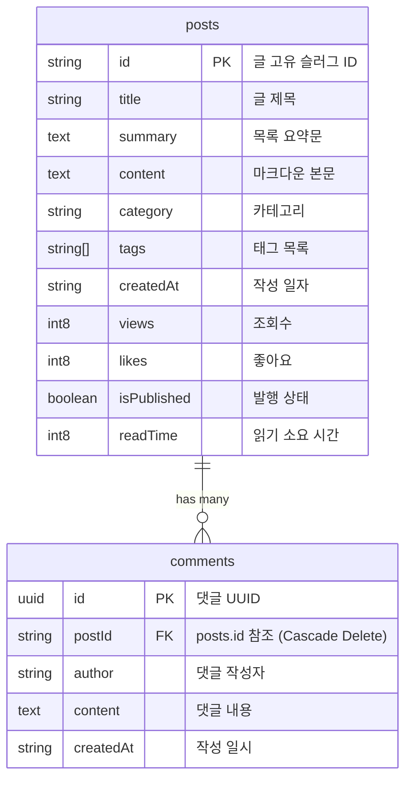

# 🎨 MyDevVlog: 전혜원의 미니멀 서버리스 기술 블로그

> **"매일 조금씩, 기록하며 성장하는 개발자 전혜원입니다."**
> 
> *기술은 사람을 편리하게 만들 때 가장 빛난다고 믿습니다. 복잡한 문제를 명료하고 깨끗하게 풀어내는 웹 엔지니어링을 통해 사용자의 일상에 긍정적인 가치와 선한 영향력을 실천하고자 합니다.*

---

## 💻 프로젝트 소개
**MyDevVlog**는 개발자 전혜원의 철학과 학습 과정을 기록하기 위해 제작된 **극적 미니멀리즘 디자인의 개인 기술 블로그 플랫폼**입니다. 

기존의 복잡한 백엔드 인프라 운영 부담을 줄이기 위해 파이썬 서버를 걷어내고, **Next.js v16**과 **Supabase (Serverless PostgreSQL)**를 결합하여 Vercel 단 하나로 무한 확장 및 24시간 실시간 무중단 가동이 가능한 **완전한 서버리스 풀스택 아키텍처**를 실현했습니다.

---

## 🛠️ 기술 스택 (Technology Stack)

### 1) Frontend
* **Framework**: `Next.js v16 (App Router)` - 최신 React Server Components(RSC) 아키텍처 활용
* **Language**: `TypeScript` - 컴파일 단계에서 안정성을 확보하는 정밀한 DTO/엔티티 타입 설계
* **Styling**: `Tailwind CSS v4` - 모던 유틸리티 CSS와 클래스 기반 다크 모드 동적 렌더링
* **Icons**: `Lucide React`
* **Markdown**: 커스텀 정규식 기반 마크다운 및 LaTeX 수학 공식 파서 탑재

### 2) Backend & Database (Serverless)
* **API Engine**: `Next.js Route Handlers (API Routes)` - Vercel Serverless Function으로 구동되는 REST API 구축
* **PaaS**: `Supabase (PostgreSQL)` - 관계형 클라우드 데이터베이스
* **API Docs**: `Swagger UI` - `/swaggers` 경로로 접속하는 독립형 실시간 API 테스트 대시보드
* **Security**: 서버단 API 라우터를 거침으로써 Supabase Secret Key가 브라우저에 노출되지 않도록 이중 보안 적용

### 3) Infrastructure & Deployment
* **Hosting**: `Vercel` - 전 세계 CDN 인프라를 통한 초고속 배포 및 환경 변수 통합 관리

---

## ✨ 핵심 기능 (Key Features)

1. **🎨 극적 미니멀리즘 UI/UX & 모치치 프로필**
   - 불필요한 위젯을 과감히 제거한 1열 레이아웃과 딥 인디고-바이올렛 가이드 라인을 적용한 유니크하고 담백한 디자인.
   - 친근한 몬치치(Monchhichi) 프로필 사진 배치.
2. **🌗 Tailwind v4 클래스 기반 테마 스위처**
   - 시스템 OS 테마(System Mode) 감지는 물론, 다크(Dark) / 라이트(Light) 수동 전환 시 HTML 클래스 주입 방식을 결합한 부드러운 테마 변환.
3. **📈 정밀 조회수(views) 트래킹 및 실시간 댓글 시스템**
   - 상세 페이지 접속 시 무조건 조회수가 올라가는 뻥튀기 버그를 개선하여, 브라우저 세션(sessionStorage) 검증을 거쳐 **최초 1회만 카운트**되도록 정밀 조절하는 비동기 영속성 설계.
   - 작성자 이름과 내용을 기반으로 실시간으로 포스트와 엮이는 관계형 댓글 보관.
4. **🔑 보안성 높은 어드민 로그인 및 콘텐츠 관리 제어판 (`/admin`)**
   - 일반 방문자에게는 "새 글 쓰기" 버튼을 완벽하게 격리.
   - 어드민 전용 비밀번호 인증 통과 시 통합 포스트 테이블, 작성(에디터), 수정(Edit), 삭제(Delete) 제어판 마운트.

---

## 💾 데이터베이스 설계 (Database Schema)

Supabase PostgreSQL 내부에 생성된 두 테이블은 **일대다(1:N) 관계**로 연결되어 있습니다.



---

## 🚀 로컬 개발 및 실행 방법

로컬 컴퓨터에서 프로젝트를 복제하고 구동하기 위한 가이드입니다.

### 1) 패키지 의존성 설치
```bash
cd minimal-blog
npm install
```

### 2) 환경 변수 파일 세팅
`minimal-blog/` 폴더 하위에 **`.env.local`** 파일을 생성하고, 내 Supabase 프로젝트의 접속 정보를 채워 넣습니다:
```text
NEXT_PUBLIC_SUPABASE_URL=https://your-project-id.supabase.co
NEXT_PUBLIC_SUPABASE_ANON_KEY=your-supabase-anon-public-jwt-key
```

### 3) 로컬 개발 서버 기동
```bash
npm run dev
```
브라우저에서 `http://localhost:3000` 으로 접속하여 연동 상태를 확인합니다.
