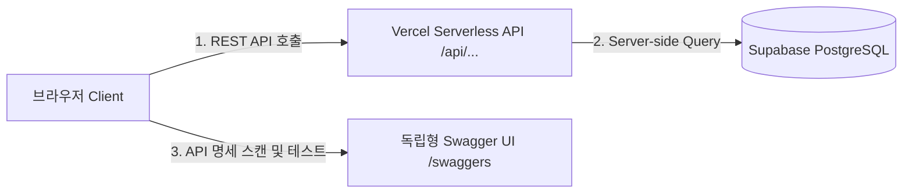

# 🛠️ MyDevVlog: 기술 스택 및 서버리스 아키텍처 명세서 (TECH_STACK.md)

개발자 전혜원의 미니멀 기술 블로그 **MyDevVlog**의 구체적인 개발 기술 스택과 서버리스 백엔드 아키텍처 설계 사양서입니다.

---

## 🏗️ 1. 풀스택 서버리스 아키텍처 (Architecture Flow)

기존 파이썬 서버 가동 및 호스팅 비용의 부담을 없애기 위해 Next.js의 서버리스 기능과 클라우드 DB를 유기적으로 결합한 **Vercel + Supabase 구조**를 채택했습니다.



### 🔐 보안 & 배포 최적화 설계
* **보안성**: Supabase Project URL 및 Anon Key가 브라우저에 직접 노출되지 않고, Vercel의 서버 사이드 환경 변수를 통해서만 처리되도록 중개자(Proxy) API 단계를 설계했습니다.
* **단일 호스팅**: 프론트엔드와 API 라우터가 Next.js 하나로 통합 배포되어 관리 비용이 $0이며, Git Push 시 Vercel Edge CDN을 통해 24시간 실시간 무중단 자동 갱신됩니다.

---

## 📊 2. 세부 기술 스택 (Tech Stack Specification)

| 레이어 | 기술 스택 | 설명 |
| :--- | :--- | :--- |
| **Frontend** | `Next.js v16` | App Router 기반의 빠른 라우팅 및 최적화된 static/dynamic 빌드 |
| | `TypeScript` | 엔티티 규격(Post, Comment 등)의 타입 안전성 및 컴파일 에러 사전 방어 |
| | `Tailwind CSS v4` | 클래스 기반 다크/라이트 테마 제어 및 극적 미니멀리즘 디자인 레이아웃 |
| | `Lucide React` | 모던 인터페이스용 벡터 아이콘 세트 |
| **Serverless API** | `Next.js Route Handlers` | `/api/posts`, `/api/posts/[id]/view` 등 JSON 데이터 송수신 REST API 구축 |
| **Database** | `Supabase (PostgreSQL)` | RLS(Row Level Security) 접근 제어 및 Cascade 관계형 테이블 보관 |
| **API Docs** | `Swagger UI` | `/swaggers` 경로로 서빙되는 독립형 공식 API 대화형 명세 대시보드 |

---

## 🔌 3. REST API 엔드포인트 세부 명세

* **`GET /api/posts`**: 전체 포스트 목록 반환 (쿼리 파라미터 `?published=false` 지원)
* **`POST /api/posts`**: 새 글 생성 (자동 400자 기준 읽기 속도 `readTime` 및 slug ID 연산 처리)
* **`GET /api/posts/{id}`**: 특정 포스트 상세 반환
* **`PUT /api/posts/{id}`**: 포스트 정보 수정 (글 내용 변경 시 `readTime` 재연산)
* **`DELETE /api/posts/{id}`**: 포스트 영구 삭제 (CASCADE 제약으로 매핑된 댓글 일괄 소멸)
* **`POST /api/posts/{id}/view`**: 세션 감지 후 최초 1회만 조회수(`views`) 카운트업 실행
* **`POST /api/posts/{id}/comments`**: 특정 포스트에 실시간 댓글 삽입

---

## 📁 4. 로컬 환경 설정 (.env.local 템플릿)

개발 환경 구동 시 프로젝트 최상위에 아래 형식의 `.env.local` 파일을 생성하여 활성화합니다.

```text
NEXT_PUBLIC_SUPABASE_URL=https://lgvpuepytluzzaagzmbw.supabase.co
NEXT_PUBLIC_SUPABASE_ANON_KEY=sb_publishable_AWifvZXuaTwyEf4BOVP_uw_Sn7UOYIo
```
